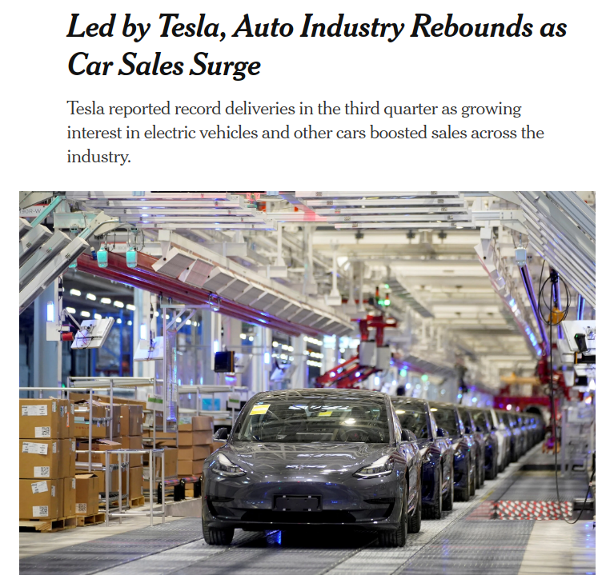

# Tesla News Sentiment Analysis 

Sentiment analysis performed on news about Tesla scraped from nytimes.com and other websites
in order to find a correlation between the media sentiment about Tesla and its stock price
movement.

## Methods and tools
* Webscraping - requests, beautifulsoup4, selenium, regex
* Threading - ThreadPoolExecutor from concurrent.futures
* Data Manipulation - Pandas
* Preprocessing - NLP, NLTK, Pandas
* Sentiment Analysis - NLTK, Numpy, scipy
* Stock Forecasting - Tensorflow, Keras, sklearn
* Visualization - Matplotlib

## Result
With extracted sentiment from the news, the model can predict whether the stock will go up or down
on the day when the news come out with 68% accuracy.
